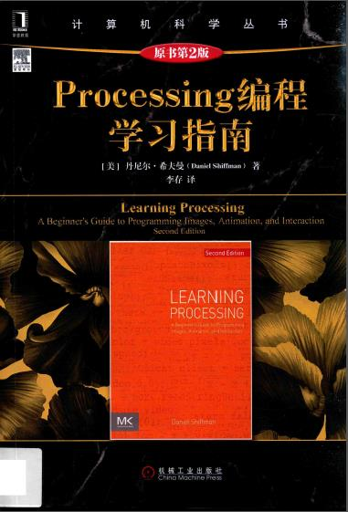

### Processing编程学习指南 示例代码

迁移到processing-py



#### 环境配置

```
$ pip install processing-py --upgrade
```

或者本地安装processing_py的whl文件
```
$ pip install wheel
$ pip install processing_py-0.3.7-py3-none-any.whl
```


#### 环境配置 Ubuntu 16.04

Ubuntu 16.04上默认的python版本是3.5, processing-py依赖的最低版本为python3.6
所以需要先在ubuntu 16.04上安装python3.6以及python3.6-pip

安装python3.6
```
$ sudo add-apt-repository ppa:deadsnakes/ppa
$ sudo apt-get update
$ sudo apt-get install python3.6
```

安装python3.6-pip
```
$ curl https://bootstrap.pypa.io/get-pip.py | sudo python3.6
```

然后安装processing_py, 安装成功后验证一下
```
$ python3.6
>>> import processing_py
```

如果提示
```
ImportError: cannot import name 'urllib3'
```
说明需要安装urllib3
```
$ sudo pip uninstall urllib3
$ sudo pip install --upgrade urllib3
```

### Processing Python Mode

由于processing_py不支持MousePressed等回调事件,
完整功能的Proccessing需要Python Mode方式实现, 扩展名为pyde.

#### 参考文档
- <https://py.processing.org/tutorials/>
- <https://tabreturn.github.io/code/processing/python/2018/06/12/processing.py_in_ten_lessons-1.1-_intro_to_processing.html>
- <https://pypi.org/project/processing-py/>
- <https://perso.telecom-paristech.fr/eagan/class/igr204/lab-p5-python>
